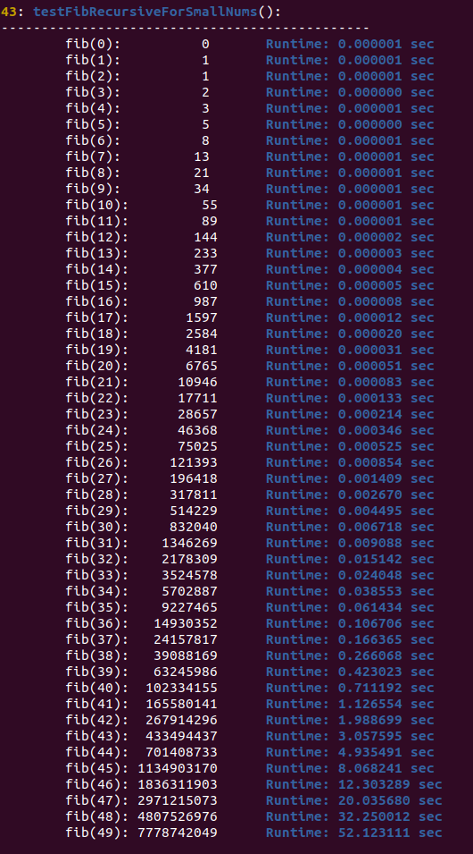
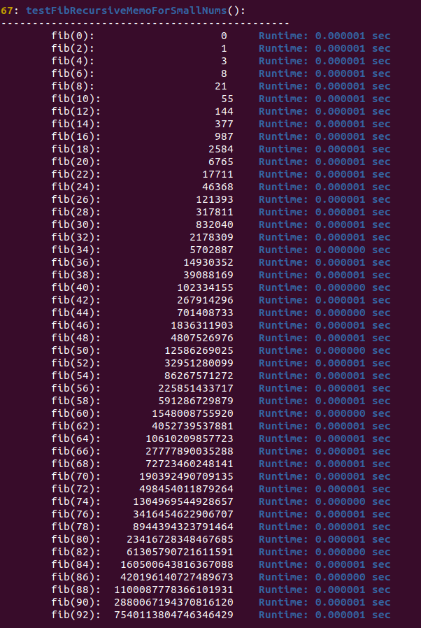
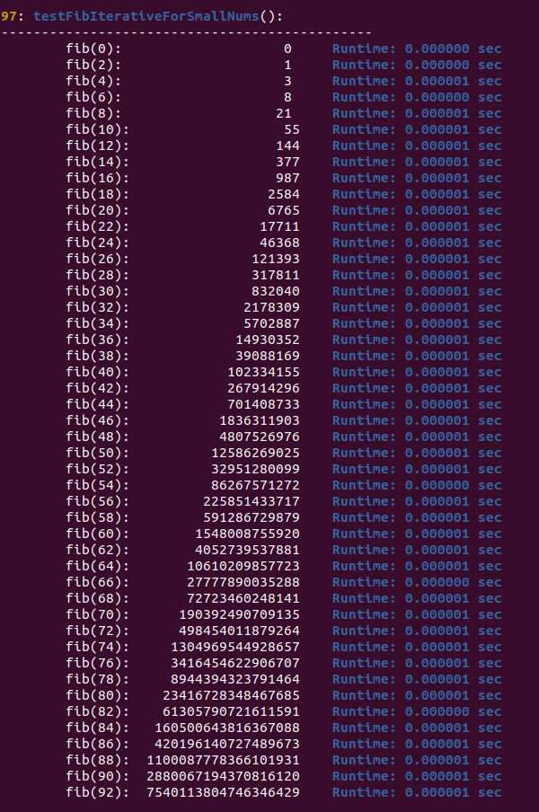
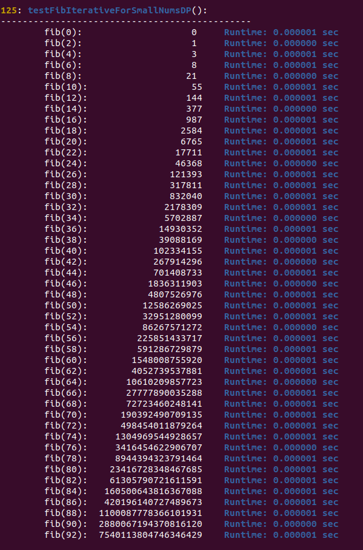
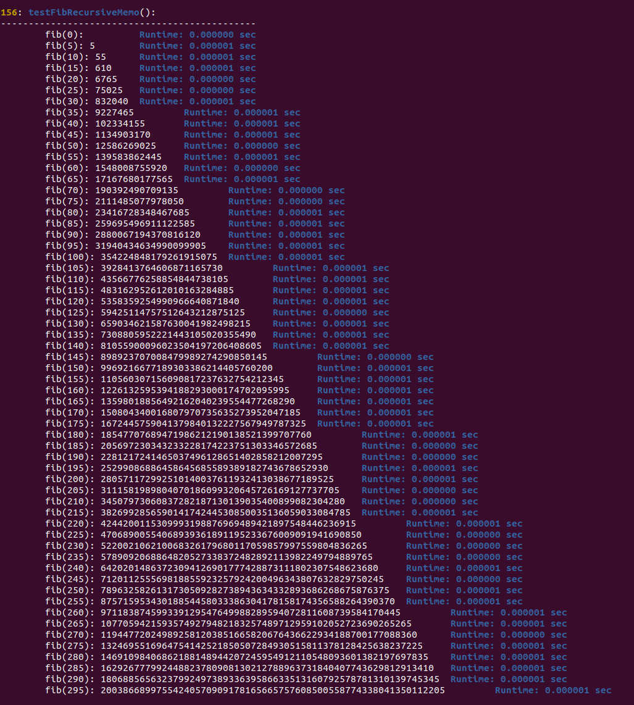
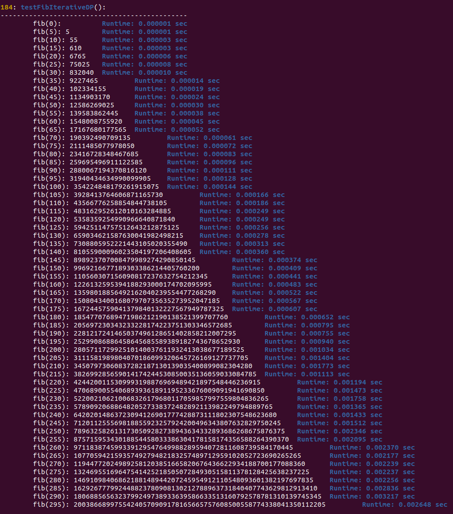

# Fibonacci
This project provides several algorithms to find Fibonacci numbers and also their run-time analysis and test results are examined.

/******************************************************************************
 * 1. Which algorithm would you use in an actual release?
 *    Given Time Complexity and Space Complexity, I would rather choose iterative
 *    version with time O(n) and space O(1). And the reason I would not choose
 *    the bruteforce one is clearly that its consumption if huge time and space
 *    complexity. However, the recursive bruteforce solution does has its use
 *    case, for example we want to show to the students how bad it is compared
 *    to other algorithm, and those students might have a very clear picture
 *    and understanding about the cost of different algorithms.
 *
 * 2. Can we make current solution better or can we make further optimization?
 *    The answer is yes. We have already taken into consideration that how to
 *    deal with storing huge numbers, bigger than long long int built-in data 
 *    types, by using a linked list to store each digit into a node and it did
 *    work pretty well. And the next step optimization might be focusing on
 *    calculating fib(n) itself, and mainly focuses on reducing time complexity.
 *    Cause current space complexity is already O(1), nothing further we can do.
 *
 *    Actually, there is a formula to calculate fib(n) 
 *      Fn = {[(√5 + 1)/2] ^ n} / √5
 *
 *    With this fomular the time complexith will be just O(1) which shall be
 *    the best so far solution for calculating Fibonacci numbers. However, we 
 *    we have to keep in mind that we have to implement sqrt(n) and pow(phi, n)
 *    utility function if there is no such libary/api ready to use.
 *
 *    For details regarding this formular, check below link:
 *    http://www.maths.surrey.ac.uk/hosted-sites/R.Knott/Fibonacci/fibFormula.html
 *
 *
 *****************************************************************************/
